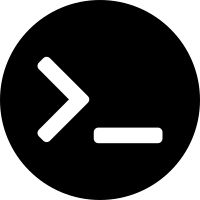
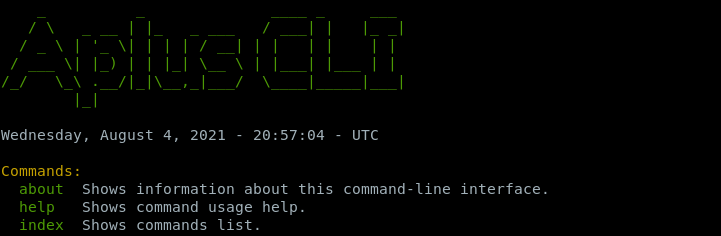
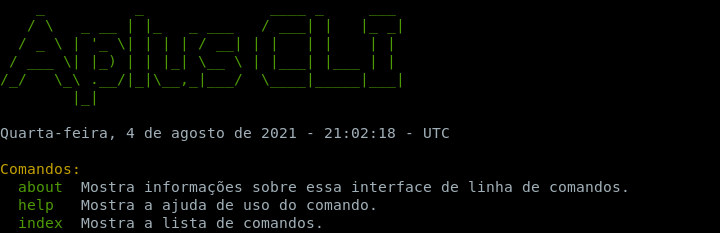
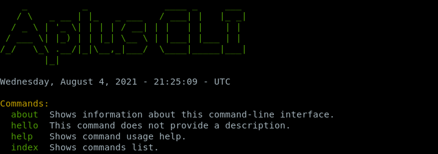

CLI
===

Aplus Framework CLI (Command-Line Interface) Library.

- `Installation`_
- `Running`_
- `Conclusion`_

Installation
------------

The installation of this library can be done with Composer:

.. code-block::

    composer require aplus/cli

Running
-------

Create a file (**cli.php**) with the following contents:

.. code-block:: php

    <?php
    require __DIR__ . '/vendor/autoload.php';

    use Framework\CLI\Console;

    $console = new Console();
    $console->run();

Go to the terminal an run:

.. code-block::

    php cli.php

The output will be like the image below:

Add a Custom Language
^^^^^^^^^^^^^^^^^^^^^

Edit the PHP file:

.. code-block:: php

    use Framework\CLI\Console;
    use Framework\Language\Language;

    $language = new Language('pt-br');

    $console = new Console($language);
    $console->run();

Run the file in the terminal.
The output will be like the following:

If the CLI Library is not localized in your language, you can contribute by adding
it with a `Merge Request in the package repository <https://gitlab.com/aplus-framework/libraries/cli/-/merge_requests>`_.

It is also possible to add custom languages at runtime. See the
`Language Library <https://gitlab.com/aplus-framework/libraries/language>`_ to know more.

Add a Custom Command
^^^^^^^^^^^^^^^^^^^^

Now, let's add your first Command.

Edit the PHP file:

.. code-block:: php

    use Framework\CLI\CLI;
    use Framework\CLI\Command;
    use Framework\CLI\Console;

    class HelloCommand extends Command
    {
        public function run(): void
        {
            CLI::write('Hello, Aplus!');
        }
    }

    $console = new Console();
    $console->addCommand(HelloCommand::class);
    $console->run();

Go to the terminal and run:

.. code-block::

    php cli.php

Note that **hello** is listed as an available command:

Run the **hello** command:

.. code-block::

    php cli.php hello

The output will be like this:

Conclusion
----------

Aplus CLI Library is an easy-to-use tool for PHP developers, beginners and experienced. 
It is perfect for building simple and full-featured command-line interfaces. 
The more you use it, the more you will learn.

.. note::
    Did you find something wrong? 
    Be sure to let us know about it with an
    `issue <https://gitlab.com/aplus-framework/libraries/cli/issues>`_. 
    Thank you!
